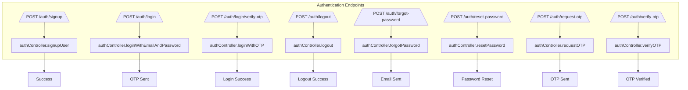

# Authentication API

This section details all API endpoints related to user authentication and authorization.

## Base URL

`http://localhost:5000/api/v1`

---

## Endpoints

### Sign Up

Registers a new user in the system.

-   **URL:** `/auth/signup`
-   **Method:** `POST`
-   **Content-Type:** `application/json`

#### Request Body

```json
{
  "name": "John Doe",
  "email": "john@example.com",
  "password": "securePassword123",
  "role": "CASHIER" // Optional, defaults to CASHIER
}
```

#### Success Response (201 Created)

```json
{
  "success": true,
  "statusCode": 201,
  "message": "User registered successfully",
  "data": {
    "id": "uuid",
    "name": "John Doe",
    "email": "john@example.com",
    "role": "CASHIER",
    "isActive": true,
    "createdAt": "2026-01-28T00:00:00.000Z",
    "updatedAt": "2026-01-28T00:00:00.000Z"
  }
}
```

---

### Login (Two-Step OTP Verification)

Initiates the login process, verifying credentials and sending an OTP for two-factor authentication.

-   **URL:** `/auth/login`
-   **Method:** `POST`
-   **Content-Type:** `application/json`

#### Request Body

```json
{
  "email": "john@example.com",
  "password": "securePassword123"
}
```

#### Success Response (200 OK)

```json
{
  "success": true,
  "statusCode": 200,
  "message": "OTP sent to your email. Valid for 5 minutes",
  "data": {
    "email": "john@example.com",
    "requiresOTP": true
  }
}
```

---

### Verify OTP and Complete Login

Completes the login process after successful OTP verification. Also creates a new user session if the device limit (max 2) is not reached.

-   **URL:** `/auth/login/verify-otp`
-   **Method:** `POST`
-   **Content-Type:** `application/json`

#### Request Body

```json
{
  "email": "john@example.com",
  "otp": "123456"
}
```

#### Success Response (200 OK)

```json
{
  "success": true,
  "statusCode": 200,
  "message": "Login successful",
  "data": {
    "id": "uuid",
    "name": "John Doe",
    "email": "john@example.com",
    "role": "CASHIER",
    "isActive": true,
    "createdAt": "2026-01-28T00:00:00.000Z",
    "accessToken": "jwt_token",
    "refreshToken": "jwt_refresh_token"
  }
}
```

#### Error Response (403 Forbidden - Device Limit Exceeded)

```json
{
  "success": false,
  "statusCode": 403,
  "message": "You have reached the maximum number of active devices (2). Please log out from another device."
}
```

#### Security Features
- OTP expires after 5 minutes
- Rate limiting: 3 OTP requests per 30 minutes
- Account blocked for 10 minutes after exceeding rate limit
- Invalid OTP returns HTTP 401 (Unauthorized)

---

### Logout

Invalidates the current user session and clears authentication cookies.

-   **URL:** `/auth/logout`
-   **Method:** `POST`

#### Success Response (200 OK)

```json
{
  "success": true,
  "statusCode": 200,
  "message": "User Logged Out Successfully",
  "data": null
}
}
```

---

### Forgot Password

Initiates the password reset process by sending a reset email to the user.

-   **URL:** `/auth/forgot-password`
-   **Method:** `POST`
-   **Content-Type:** `application/json`

#### Request Body

```json
{
  "email": "john@example.com"
}
```

#### Success Response (200 OK)

```json
{
  "success": true,
  "statusCode": 200,
  "message": "Password reset email sent successfully",
  "data": null
}
```

---

### Reset Password

Resets the user's password using a valid reset token.

-   **URL:** `/auth/reset-password`
-   **Method:** `POST`
-   **Content-Type:** `application/json`

#### Request Body

```json
{
  "token": "reset_token_from_email",
  "password": "newSecurePassword123",
  "confirmPassword": "newSecurePassword123"
}
```

#### Success Response (200 OK)

```json
{
  "success": true,
  "statusCode": 200,
  "message": "Password reset successfully",
  "data": null
}
```

---

### Request OTP (One-Time Password)

Requests a new OTP to be sent to the user's email.

-   **URL:** `/auth/request-otp`
-   **Method:** `POST`
-   **Content-Type:** `application/json`

#### Request Body

```json
{
  "email": "john@example.com"
}
```

#### Success Response (200 OK)

```json
{
  "success": true,
  "statusCode": 200,
  "message": "OTP sent successfully to your email. Valid for 5 minutes",
  "data": null
}
```

#### Rate Limiting

- Maximum 3 OTP requests per 30-minute window
- 10-minute blocking period after exceeding limit
- Returns HTTP 429 (Too Many Requests) when rate limit exceeded

#### Error Response (429 Too Many Requests)

```json
{
  "success": false,
  "statusCode": 429,
  "message": "Too many OTP requests. Please try again after 10 minutes.",
  "data": null
}
}
```

---

### Verify OTP

Verifies a provided OTP without initiating a full login flow (useful for other OTP-protected actions).

-   **URL:** `/auth/verify-otp`
-   **Method:** `POST`
-   **Content-Type:** `application/json`

#### Request Body

```json
{
  "email": "john@example.com",
  "otp": "123456"
}
```

#### Success Response (200 OK)


## API Flowchart

