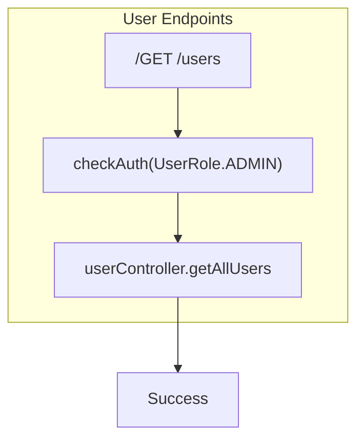

# User Management API

This section details all API endpoints related to user management.

## Base URL

`http://localhost:5000/api/v1`

---

## Endpoints

### Get User Profile

Retrieves the profile of the currently authenticated user.

-   **URL:** `/user/profile`
-   **Method:** `GET`
-   **Authentication:** Required (Access Token)

#### Success Response (200 OK)

```json
{
  "success": true,
  "statusCode": 200,
  "message": "User profile retrieved successfully",
  "data": {
    "id": "uuid",
    "name": "John Doe",
    "email": "john@example.com",
    "role": "CASHIER",
    "isActive": true,
    "createdAt": "2026-01-28T00:00:00.000Z",
    "updatedAt": "2026-01-28T00:00:00.000Z"
  }
}
```

##### Data Fields

| Field     | Type    | Description                                   | Example                      |
| :-------- | :------ | :-------------------------------------------- | :--------------------------- |
| `id`      | `string` | Unique identifier of the user.                | `uuid`                       |
| `name`    | `string` | Name of the user.                             | `John Doe`                   |
| `email`   | `string` | Email address of the user.                    | `john@example.com`           |
| `role`    | `string` | Role of the user (e.g., CASHIER).             | `CASHIER`                    |
| `isActive`| `boolean`| Indicates if the user account is active.      | `true`                       |
| `createdAt`| `string` | Date and time the user was created (ISO 8601).| `2026-01-28T00:00:00.000Z`   |
| `updatedAt`| `string` | Date and time the user was last updated (ISO 8601).| `2026-01-28T00:00:00.000Z`   |

---

### Update User Profile

Updates the profile of the currently authenticated user.

-   **URL:** `/user/profile`
-   **Method:** `PATCH`
-   **Authentication:** Required (Access Token)
-   **Content-Type:** `application/json`

#### Request Body

```json
{
  "name": "John Updated",
  "email": "john.updated@example.example.com"
}
}
```

#### Success Response (200 OK)

```json
{
  "success": true,
  "statusCode": 200,
  "message": "User profile updated successfully",
  "data": {
    "id": "uuid",
    "name": "John Updated",
    "email": "john.updated@example.com",
    "role": "CASHIER",
    "isActive": true,
    "createdAt": "2026-01-28T00:00:00.000Z",
    "updatedAt": "2026-01-28T00:00:00.000Z"
  }
}
```

##### Data Fields

| Field     | Type    | Description                                   | Example                      |
| :-------- | :------ | :-------------------------------------------- | :--------------------------- |
| `id`      | `string` | Unique identifier of the user.                | `uuid`                       |
| `name`    | `string` | Name of the user.                             | `John Updated`               |
| `email`   | `string` | Email address of the user.                    | `john.updated@example.com`   |
| `role`    | `string` | Role of the user (e.g., CASHIER).             | `CASHIER`                    |
| `isActive`| `boolean`| Indicates if the user account is active.      | `true`                       |
| `createdAt`| `string` | Date and time the user was created (ISO 8601).| `2026-01-28T00:00:00.000Z`   |
| `updatedAt`| `string` | Date and time the user was last updated (ISO 8601).| `2026-01-28T00:00:00.000Z`   |

---

## User Endpoints

### Get All Users (Admin Only)

Retrieves a list of all users in the system. Requires `ADMIN` or `SUPER_ADMIN` role.

-   **URL:** `/users`
-   **Method:** `GET`
-   **Authentication:** Required (Access Token with `ADMIN` or `SUPER_ADMIN` role)

#### Success Response (200 OK)

```json
{
  "success": true,
  "statusCode": 200,
  "message": "Users retrieved successfully",
  "data": [
    {
      "id": "uuid1",
      "name": "John Doe",
      "email": "john@example.com",
      "role": "CASHIER",
      "isActive": true,
      "createdAt": "2026-01-28T00:00:00.000Z",
      "updatedAt": "2026-01-28T00:00:00.000Z"
    },
    {
      "id": "uuid2",
      "name": "Admin User",
      "email": "admin@example.com",
      "role": "ADMIN",
      "isActive": true,
      "createdAt": "2026-01-28T00:00:00.000Z",
      "updatedAt": "2026-01-28T00:00:00.000Z"
    }
  ]
}
```

##### Data Fields (Array of User Objects)

| Field     | Type    | Description                                   | Example                      |
| :-------- | :------ | :-------------------------------------------- | :--------------------------- |
| `id`      | `string` | Unique identifier of the user.                | `uuid1`                      |
| `name`    | `string` | Name of the user.                             | `John Doe`                   |
| `email`   | `string` | Email address of the user.                    | `john@example.com`           |
| `role`    | `string` | Role of the user (e.g., CASHIER).             | `CASHIER`                    |
| `isActive`| `boolean`| Indicates if the user account is active.      | `true`                       |
| `createdAt`| `string` | Date and time the user was created (ISO 8601).| `2026-01-28T00:00:00.000Z`   |
| `updatedAt`| `string` | Date and time the user was last updated (ISO 8601).| `2026-01-28T00:00:00.000Z`   |

---

## User Roles

This section describes the different user roles available in the system and their respective access levels.

-   **SUPER_ADMIN**: Full system access, including management of all other roles and system configurations.
-   **ADMIN**: Administrative access, typically for managing users within their scope and specific application settings.
-   **CASHIER**: Basic access, limited to performing daily operational tasks within the POS system.

## API Flowchart


